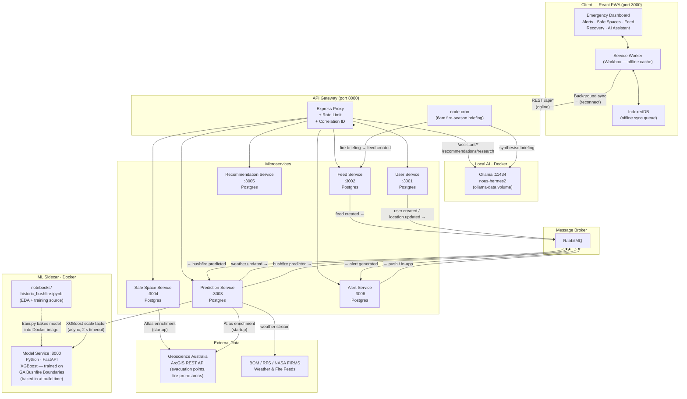

# Project Haven

> AI-powered emergency response and disaster recovery platform for bushfire preparedness.

Originally built at **GovHack 2024** (and won). Rebuilt from the ground up as a production-grade platform.

---

## What it does

During a bushfire, information is survival. Project Haven answers the three questions that matter most:

- **Where do I go?** — nearest open evacuation centres with capacity and accessibility info
- **How bad is it?** — real-time risk prediction from live weather streams + historical fire data
- **What do I do after?** — verified government grants and recovery services matched to your situation

It works offline. When mobile networks go down mid-crisis — and they will — the app keeps working from a local cache.

---

## TL;DR — Run Locally

```bash
git clone https://github.com/ujjavala/project-haven.git
cd project-haven
cp .env.example .env
docker compose up --build
```

Open **http://localhost:3000** — done.

---

## Quick Start

```bash
cp .env.example .env
docker compose up --build
```

One command starts 6 microservices, an API gateway, PostgreSQL instances, RabbitMQ, and the React PWA at `http://localhost:3000`.

**Trigger the full prediction → alert pipeline:**

```bash
curl -X POST http://localhost:8080/weather \
  -H 'Content-Type: application/json' \
  -d '{
    "lat": -33.87,
    "lng": 151.21,
    "temperature": 42,
    "windSpeed": 80,
    "humidity": 10,
    "season": "summer",
    "vegetationDensity": 0.9
  }'
```

This simulates an extreme weather event near Sydney. The prediction engine scores it, publishes a `bushfire.predicted` event, and the alert service fires a CRITICAL notification — all within seconds.

---

## Architecture



> The Mermaid source is also available as [`architecture.mmd`](architecture.mmd).

---

## Repository Structure

```
project-haven/
├── client/pwa/              # React + TypeScript + Vite PWA
│   └── src/
│       ├── pages/           # Dashboard, Alerts, SafeSpaces, Feed, Recovery,
│       │                    # AIAssistant, Settings, Onboarding
│       ├── components/      # Nav, AlertList, SafeSpaceList, HavenMap
│       ├── hooks/           # useGeolocation, useOnlineStatus
│       └── workers/         # Workbox service worker config
├── server/
│   ├── api-gateway/         # Express reverse proxy, rate limiting
│   ├── user-service/        # CRUD users, JWT auth, audit logging
│   ├── feed-service/        # Community feed, event stream
│   ├── prediction-service/  # Bushfire risk engine (FFDI + XGBoost blend)
│   ├── safe-space-service/  # Evacuation point recommendations
│   ├── recommendation-service/ # Government grants & recovery services
│   ├── alert-service/       # Tiered push notifications, <5s delivery
│   └── shared/              # @haven/shared — events, DTOs, logger
├── notebooks/               # EDA + XGBoost model training (Python)
├── server/model-service/    # Python FastAPI sidecar serving the trained model
├── docker-compose.yml
├── architecture.mmd         # Mermaid architecture diagram
├── blog.md                  # GitHub Finish-Up-A-Thon submission
└── blog-hermes.md           # Hermes Agent Challenge submission
```

---

## Services

| Service | Port | Responsibilities |
|---|---|---|
| **api-gateway** | 8080 | Proxy, rate limiting, correlation IDs |
| **user-service** | 3001 | User CRUD, JWT auth, location, audit log |
| **feed-service** | 3002 | Community feed, high-write event stream |
| **prediction-service** | 3003 | Fire risk from weather streams + historical data |
| **safe-space-service** | 3004 | Evacuation points, distance ranking, Atlas enrichment |
| **recommendation-service** | 3005 | Scenario-based grants and recovery services |
| **alert-service** | 3006 | Tiered notifications, retry, offline sync |

---

## Event Pipeline

All inter-service communication is asynchronous via RabbitMQ:

```
weather.updated  →  prediction-service  →  bushfire.predicted
                                       →  alert-service       →  alert.generated
user-service     →  user.created / location.updated
feed-service     →  feed.created
```

Event envelope shape (from `@haven/shared`):

```typescript
{
  eventId:       UUID
  correlationId: UUID
  timestamp:     string  // ISO 8601
  source:        string
  version:       string
  payload:       object
}
```

---

## Atlas Data Integration

At startup, three services enrich their databases with live data from the [Geoscience Australia ArcGIS REST API](https://services.ga.gov.au/gis/rest/services/):

- **safe-space-service** — queries Topographic Facilities (`HSPT`, `COMM`, `STAD`, `SCHL`) for real Australian evacuation-capable venues
- **prediction-service** — queries fire-prone area polygons; falls back to 12 curated historically high-risk locations
- **recommendation-service** — adds 8 additional verified Australian recovery programs (Services Australia, Red Cross, state grants)

All enrichment is fire-and-forget — never blocks startup, never throws.

---

## Frontend

Mobile-first offline-capable PWA with an emergency-first design system:

| Screen | Key Features |
|---|---|
| **Dashboard** | Risk severity banner (animated CRITICAL pulse), stat tiles, map, sticky CTAs |
| **Alerts** | Full-screen overlay for CRITICAL, tiered behaviour by priority |
| **Safe Spaces** | Ranked by distance, capacity bars, accessibility badges, filter buttons |
| **Feed** | Community updates, compose, verification badges |
| **Recovery** | Scenario grid, live AI grant search (Hermes via `/recommendations/research`), static seed cards, eligibility, Apply Now links |
| **AI Assistant** | Chat powered by Nous Hermes 2 (Ollama), emergency guidance, quick prompts, 000 escalation |
| **Onboarding** | 4-step permissions flow (location → notifications → offline) |
| **Settings** | Toggles, emergency contacts, accessibility options |

**Offline behaviour:** network-first → cache fallback → background sync queue → conflict reconciliation on reconnect.

---

## Prediction Engine

The `prediction-service` uses a **two-signal blend**:

| Signal | Source | Weight |
|---|---|---|
| **FFDI** (McArthur Mark 5) | `engine.ts` — real-time weather: temperature, humidity, wind | 80% |
| **XGBoost scale factor** | `model-service` Python sidecar — historical fire-size percentile from GA Bushfire Boundaries dataset | 20% |

```
blendedSeverity = FFDI_severity × 0.80 + xgboost_scale × 0.20
```

**FFDI** is the official Australian fire danger formula used by the Bureau of Meteorology. It accepts temperature, humidity, wind speed, and a drought factor (derived from soil moisture or falling back to monthly climatological priors extracted from the training dataset).

**XGBoost** was trained on the Geoscience Australia Historical Bushfire Boundaries dataset (1970–2023, ~295k fires). After fixing the original hackathon bugs (`test_size=0.8` flipped; `area_ha < 3` outlier filter that discarded all large fires), the model reaches R² > 0.99 with XGBoost (vs ~0.65 with ElasticNet). At prediction time, the model receives `{month, state, year}` and returns the expected fire size percentile for that region/season — a historical context signal.

**model-service** is a non-critical-path FastAPI sidecar. `prediction-service` calls it with a 2-second timeout. If it is unavailable, scoring falls back to FFDI-only — there is no hard dependency on the critical path.

- Output: `severity` (0–1), `confidence` (0–1), `radiusKm`, `spreadDirection`, `ffdi` (raw score), `dangerRating` (BOM text label)
- FFDI danger ratings: Low · Moderate · High · Very High · Severe · Extreme/Catastrophic

---

## Datasets

| Dataset | Source | Used for |
|---|---|---|
| Historical Bushfire Boundaries | [Digital Atlas](https://digital.atlas.gov.au/datasets/digitalatlas::historical-bushfire-boundaries-3/about) | XGBoost model training; seasonal drought-factor priors |
| Topographic Facilities | [GA ArcGIS REST](https://services.ga.gov.au/gis/rest/services/Topographic/Facilities/FeatureServer/0) | Evacuation point enrichment |
| ABS Family & Community | [ABS 2021 Census](https://abs.gov.au/census/find-census-data/quickstats/2021/128021538) | Community vulnerability analysis |
| 3-hourly Bushfire Accumulation | [Digital Atlas](https://digital.atlas.gov.au/datasets/digitalatlas::3-hourly-bushfire-accumulation/about) | Fire spread modelling |

---

## Non-Functional Targets

| Requirement | Target |
|---|---|
| API latency | < 300 ms |
| Alert delivery | < 5 s |
| Offline startup | < 2 s |
| Prediction processing | Near real-time |

---

## Tech Stack

- **Frontend:** React 18, TypeScript, Vite, Workbox PWA, Leaflet, lucide-react
- **Backend:** Node.js 20, Express, TypeScript (strict)
- **AI:** Nous Hermes 2 via Ollama (OpenAI-compatible, locally hosted — chat, grant research, fire briefings)
- **Messaging:** RabbitMQ
- **Databases:** PostgreSQL (per-service)
- **ML:** XGBoost (Python `model-service`) + McArthur FFDI Mark 5 (TypeScript `engine.ts`) — blended 80/20
- **Infra:** Docker Compose, multi-stage builds, `@haven/shared` local npm package
- **Data:** Geoscience Australia / Digital Atlas ArcGIS REST APIs

---

*Originally built at GovHack 2024. Rebuilt properly in 2026.*


